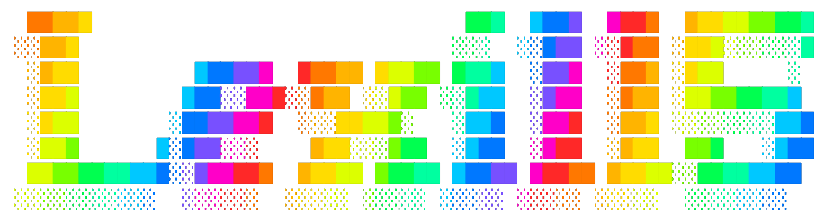

<link rel="stylesheet" type='text/css' href="https://cdn.jsdelivr.net/gh/devicons/devicon@latest/devicon.min.css" />

    
    <h3 style="margin: 0; padding: 0"><em>✨ Aspiring Web Developer ✨</em></h3>

    <h3 style="margin: 0; padding: 20px">:•––– About me –––•:</h3>

<strong>I was raised by the Internet, no wonder I’m interested in what’s going on “behind the curtain.”</strong> This is the main reason I’m studying hard to become a web developer despite AI becoming more prominent and enticing than ever.

Oh, and I love cooking! 🍝🍖🍕🍆🥔

    <h3 style="margin: 0; padding: 20px">:•––– My Tech Stack –––•:</h3>
    
    
    
    
    
     
    

